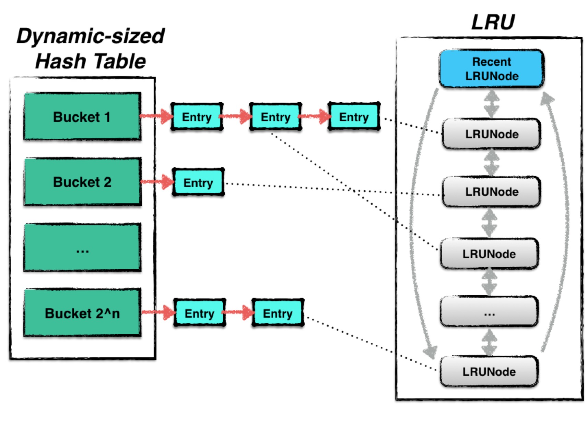

---
哈希表要求实现常数时间的插入、重新移动和查找操作。

用一个哈希函数将键哈希到多个bucket，O(1)的时间找到对应的bucket，然后保证bucket中只有常数个元素，如果bucket中的元素数量过多，则扩增bucket的数量。

**LevelDB的cache结构**



---

论文（A LOCK-FREE, DYNAMIC-SIZED HASH SET ALGORITHM）

```latex
@inproceedings{liu2014dynamic,
  title={Dynamic-sized nonblocking hash tables},
  author={Liu, Yujie and Zhang, Kunlong and Spear, Michael},
  booktitle={Proceedings of the 2014 ACM symposium on Principles of distributed computing},
  pages={242--251},
  year={2014}
}

```

引入可冻结集合对象

哈希表由一系列**哈希表节点**构成，每一个哈希表节点表示一个新的哈希版本，一个新版本由一次resize生成。

一个**哈希表节点**由一个桶序列构成，不同的节点桶的数量可能不一样

一个前向指针指向上一个哈希表节点（上一个版本）

每一次resize将数组的长度加倍或减小为原来的一半


