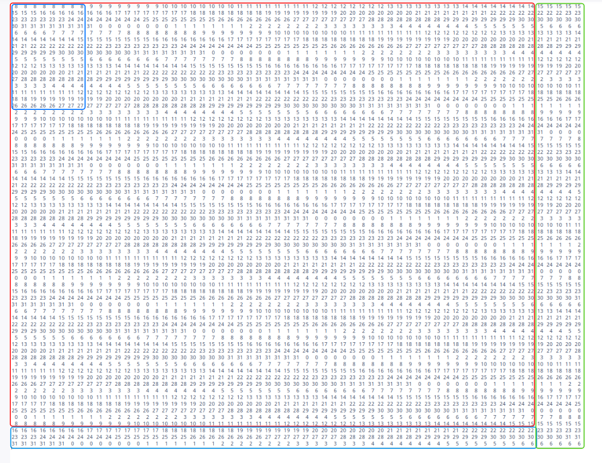

---

Part A

编写一个cache模拟器，不是模拟真正的cache主要目的是模拟一个使用LRU策略的cache对于给定内存操作请求序列的命中、不命中、换出次数

模拟器程序的运行参数形如`./csim -s 4 -E 1 -b 4 -t traces/yi.trace`

| 参数 |                                                       |
| ---- | ----------------------------------------------------- |
| $-s$ | 标记cache组数的比特数（有 $2^s$ 组）                  |
| $-E$ | 每组内有多少个cache行（每组 $E$ 行）                  |
| $-b$ | 标记块内偏移的比特数  （每个高速缓存行有 $2^b$ 字节） |
| $-t$ | valgrind内存追踪文件的位置                            |

本题中输入的内存追踪文件显示使用的是32位地址

| 高32-s-b位 | 中间s位   | 低b位 |
| ---- | ---- | ---- |
|行标记<br>如果在对应的组中<br>找到行标记相同的行<br>就说明命中了这个块|指示当前cache块在哪个组|该地址指向的字节<br>在cache块中的偏移量|

part A的详细注释代码如下：


---

Part B

编写函数完成矩阵转置，输入矩阵可能是三种情况：32$\times$32、64$ \times $64、61$ \times $67。要求只能定义12个局部变量、不能使用递归、不能使用任何数组或开辟新内存空间、优化的目标系统cache有32组、每组一行、每行32字节（8个int）

#### 32 $ \times $ 32

通过内存追踪文件看到矩阵A的起始地址(0x404100)和矩阵B的起始地址(0x444100)是放在cache同一行的，进一步说明矩阵A和矩阵B中同行同列的元素都应该被放到cache的相同行内。这就回导致冲突不命中的发生。

显示这个32 $ \times $ 32矩阵每个int变量应该被放到cache的第几个集合：


使用$ 8\times8$分块的思想


比如将A矩阵中红色框的分块转置到B矩阵蓝色框对应的位置内，对于矩阵A<font color=red>**分块**</font>中的元素，我们按行读取，每一行只有第一个元素会不命中，然后后面剩余的7个元素都会被复制到cache对应的行当中，剩余的元素都可以命中。而讲红色分块中的行转置到蓝色分块中的列时，只有在操作第一列时会遇到8次不命中，然后后面同分块的每一列都可以命中。事实上可以用任意的顺序将上图中红色分块内的元素转置到蓝色分块中，因为这两个分块不存在任何的cache行冲突，只有第一次读进一个cache行时会有一次miss，其余元素的操作都可以在cache内进行。

按照这样粗略的分块，代码为：

```c
if (M == 32 && N == 32) {
    //遍历每个分块
    for (r = 0; r < 32; r += 8) {
        for (c = 0; c < 32; c += 8) {
            //遍历分块内的每个元素
            for (q = 0; q < 8; q++) {
                for (w = 0; w < 8; w++) {
                    B[c + w][r + q] = A[r + q][c + w];
                }
            }
        }
    }
}
```


上面的做法拿不到满分因为对角线的分块会产生冲突不命中，比如这个最左上角的分块


当读A矩阵上述分块的第一行第一列元素时，cache第八个集合中放的是A矩阵分块的第一行整行，再把这个元素复制到B矩阵的第一行第一列时，cache第八个集合不得不将A矩阵分块的第一行换出，再换如B矩阵的第一行。那么读取A矩阵分块第一行第二个元素时，就又出现了不命中。

为了减少这样的不命中情形，使用局部变量一次性读取A矩阵分块的一整行

```c
if (M == 32 && N == 32) {
    for (r = 0; r < 32; r += 8) {
        for (c = 0; c < 32; c += 8) {
            for (q = 0; q < 8; q++) {
                a = A[r + q][c + 0];
                s = A[r + q][c + 1];
                d = A[r + q][c + 2];
                f = A[r + q][c + 3];
                g = A[r + q][c + 4];
                h = A[r + q][c + 5];
                j = A[r + q][c + 6];
                k = A[r + q][c + 7];
                B[c + 0][r + q] = a;
                B[c + 1][r + q] = s;
                B[c + 2][r + q] = d;
                B[c + 3][r + q] = f;
                B[c + 4][r + q] = g;
                B[c + 5][r + q] = h;
                B[c + 6][r + q] = j;
                B[c + 7][r + q] = k;
            }
        }
    }
}
```


#### 64 $\times$ 64

如果使用和上一题一样的分块方法

```c
else if (M == 64 && N == 64) {
    for (r = 0; r < 64; r += 8) {
        for (c = 0; c < 64; c += 8) {
            for (q = 0; q < 8; q++) {
                a = A[r + q][c + 0];
                s = A[r + q][c + 1];
                d = A[r + q][c + 2];
                f = A[r + q][c + 3];
                g = A[r + q][c + 4];
                h = A[r + q][c + 5];
                j = A[r + q][c + 6];
                k = A[r + q][c + 7];
                B[c + 0][r + q] = a;
                B[c + 1][r + q] = s;
                B[c + 2][r + q] = d;
                B[c + 3][r + q] = f;
                B[c + 4][r + q] = g;
                B[c + 5][r + q] = h;
                B[c + 6][r + q] = j;
                B[c + 7][r + q] = k;
            }
        }
    }
}
```

效果很不理想


因为随着矩阵增大，矩阵内元素所属的cache行也发生了变化


观察局部：


将A矩阵中红色分块转置到B矩阵中蓝色分块时，B矩阵中的第一行和第五行 、第二行和第六行（每间隔3行）会有一次冲突不命中


考虑使用B矩阵作为中转，如上图所示，将<font color=red>区域1</font>的转置放置到<font color=blue>区域3</font>，将区域2的转置放置到<font color=blue>区域4</font>，之所以不放到<font color=blue>区域5</font>，是因为<font color=blue>区域5</font>和<font color=blue>区域3</font>的相同行会发生冲突不命中

概括操作流程就是

<font color=red>区域1</font>的转置 $\rightarrow$ <font color=blue>区域3</font><br><font color=red>区域2</font>的转置 $\rightarrow$ <font color=blue>区域4</font><br><font color=red>区域7</font>的转置 $\rightarrow$ <font color=blue>区域5</font><br><font color=red>区域8</font>的转置 $\rightarrow$ <font color=blue>区域6</font>

然后交换<font color=blue>区域4</font>和<font color=blue>5</font>

上述操作代码为：

```c
else if (M == 64 && N == 64) {
    for (r = 0; r < 64; r += 8) {
        for (c = 0; c < 64; c += 8) {
            for (q = 0; q < 4; q++) {
                ///区域1和2的转置放置到区域3和4
                a = A[r + q][c + 0];
                s = A[r + q][c + 1];
                d = A[r + q][c + 2];
                f = A[r + q][c + 3];
                g = A[r + q][c + 4];
                h = A[r + q][c + 5];
                j = A[r + q][c + 6];
                k = A[r + q][c + 7];
                B[c + 0][r + q] = a;
                B[c + 1][r + q] = s;
                B[c + 2][r + q] = d;
                B[c + 3][r + q] = f;
                B[c + 4 - 4][r + q + 4] = g;
                B[c + 5 - 4][r + q + 4] = h;
                B[c + 6 - 4][r + q + 4] = j;
                B[c + 7 - 4][r + q + 4] = k;
            }
            for (q = 4; q < 8; q++) {
                ///区域7和8的转置放置到区域5和6
                a = A[r + q][c + 0];
                s = A[r + q][c + 1];
                d = A[r + q][c + 2];
                f = A[r + q][c + 3];
                g = A[r + q][c + 4];
                h = A[r + q][c + 5];
                j = A[r + q][c + 6];
                k = A[r + q][c + 7];
                B[c + 0 + 4][r + q - 4] = a;
                B[c + 1 + 4][r + q - 4] = s;
                B[c + 2 + 4][r + q - 4] = d;
                B[c + 3 + 4][r + q - 4] = f;
                B[c + 4][r + q] = g;
                B[c + 5][r + q] = h;
                B[c + 6][r + q] = j;
                B[c + 7][r + q] = k;
            }
            for (q = 0; q < 4; q++) {
                a = B[c + q + 4][r + 0];
                s = B[c + q + 4][r + 1];
                d = B[c + q + 4][r + 2];
                f = B[c + q + 4][r + 3];
                g = B[c + q][r + 4];
                h = B[c + q][r + 5];
                j = B[c + q][r + 6];
                k = B[c + q][r + 7];
                B[c + q][r + 4] = a;
                B[c + q][r + 5] = s;
                B[c + q][r + 6] = d;
                B[c + q][r + 7] = f;
                B[c + q + 4][r + 0] = g;
                B[c + q + 4][r + 1] = h;
                B[c + q + 4][r + 2] = j;
                B[c + q + 4][r + 3] = k;
            }
        }
    }
}
```


还是不够好

继续优化

上述操作的问题在于，当我们将<font color=blue>区域4</font>和<font color=blue>区域5</font>交换位置时：

1. 读取<font color=blue>区域4</font>的一行需要支付一次miss的代价，
2. 读取<font color=blue>区域5</font>的一行，因为这一行和刚才读的<font color=blue>区域4</font>的一行只能被放到cache的相同位置，所以产生冲突，需要将这一行换入cache，支付第二次miss的代价。
3. 然后将存储在局部变量中的<font color=blue>区域4</font>的一行存放到<font color=blue>区域5</font>中不会产生miss，
4. 将存储在局部变量中的<font color=blue>区域5</font>的一行放到<font color=blue>区域4</font>的时候，又要将cache中缓存的<font color=blue>区域5</font>的那一行换出，支付一次miss的代价。

交换的过程因为大量的冲突不命中而效率底下

除了交换操作外，前面的转置操作还会产生16次miss（每一行在第一次读取时都有一次miss）。转置一个8 $\times$ 8的分块最多产生大约32次miss

**优化为：**

<font color=red>区域1</font>的转置 $\rightarrow$ <font color=blue>区域3</font><br><font color=red>区域2</font>的转置 $\rightarrow$ <font color=blue>区域4</font><br>

上述放置操作产生8次miss

读取<font color=red>区域7</font>的一列到局部变量，第一次会产生4次miss，后面可以直接读缓存

读读取<font color=blue>区域4</font>的一行到局部变量，产生一次miss

将局部变量中<font color=red>区域7</font>的一列放到<font color=blue>区域4</font>的一行，因为刚刚读过<font color=blue>区域4</font>的行，所以不会miss

将局部变量中<font color=blue>区域4</font>的一行放置到<font color=blue>区域5</font>的一行，产生一次miss

再将<font color=red>区域8</font>的一列放置到<font color=blue>区域6</font>的一行，因为刚刚读过<font color=blue>区域5</font>的行，<font color=blue>区域6</font>的行因为在同一个32字节块内，所以不会miss

转置一个8 $\times$ 8的分块总共产生大约20次miss

```c
else if (M == 64 && N == 64) {
    for (r = 0; r < 64; r += 8) {
        for (c = 0; c < 64; c += 8) {
            for (q = 0; q < 4; q++) {
                ///区域1和2的转置放置到区域3和4
                a = A[r + q][c + 0];
                s = A[r + q][c + 1];
                d = A[r + q][c + 2];
                f = A[r + q][c + 3];
                g = A[r + q][c + 4];
                h = A[r + q][c + 5];
                j = A[r + q][c + 6];
                k = A[r + q][c + 7];
                B[c + 0][r + q] = a;
                B[c + 1][r + q] = s;
                B[c + 2][r + q] = d;
                B[c + 3][r + q] = f;
                B[c + 4 - 4][r + q + 4] = g;
                B[c + 5 - 4][r + q + 4] = h;
                B[c + 6 - 4][r + q + 4] = j;
                B[c + 7 - 4][r + q + 4] = k;
            }
            for (q = 0; q < 4; q++) {
                ///从区域7读取第q列到局部变量
                g = A[r + 4 + 0][c + q];
                h = A[r + 4 + 1][c + q];
                j = A[r + 4 + 2][c + q];
                k = A[r + 4 + 3][c + q];
                ///从区域4读取第q行到局部变量
                a = B[c + q][r + 4 + 0];
                s = B[c + q][r + 4 + 1];
                d = B[c + q][r + 4 + 2];
                f = B[c + q][r + 4 + 3];
                ///将区域7中的第q列放置到区域4中的第q行
                B[c + q][r + 4 + 0] = g;
                B[c + q][r + 4 + 1] = h;
                B[c + q][r + 4 + 2] = j;
                B[c + q][r + 4 + 3] = k;
                ///将局部变量中区域4的第q行放置到区域5的第q行
                B[c + 4 + q][r + 0] = a;
                B[c + 4 + q][r + 1] = s;
                B[c + 4 + q][r + 2] = d;
                B[c + 4 + q][r + 3] = f;
                ///从局部变量读区域8的第q列
                a = A[r + 4 + 0][c + 4 + q];
                s = A[r + 4 + 1][c + 4 + q];
                d = A[r + 4 + 2][c + 4 + q];
                f = A[r + 4 + 3][c + 4 + q];
                ///将局部变量中存储的区域8的第q列放置到区域6的第q行
                B[c + 4 + q][r + 4 + 0] = a;
                B[c + 4 + q][r + 4 + 1] = s;
                B[c + 4 + q][r + 4 + 2] = d;
                B[c + 4 + q][r + 4 + 3] = f;
            }
        }
    }
}
```

优化后减少了交换区域4和5的开销，还节省了将区域8的转置放到区域6的开销

#### 61$\times$67

不规则的矩阵，变长都不是8的倍数，只能尝试使用分块解决，没有很好的规律

注意：转置前的矩阵有67行61列，转置后得到61$\times$67的矩阵


按照上图划分的区域进行转置

红色区域采用8×8分块

```c
else {
    ///转置红色矩形部分
    for (r = 0; r < 64; r += 8) {
        for (c = 0; c < 56; c += 8) {
            for (q = 0; q < 8; q++) {
                a = A[r + q][c + 0];
                s = A[r + q][c + 1];
                d = A[r + q][c + 2];
                f = A[r + q][c + 3];
                g = A[r + q][c + 4];
                h = A[r + q][c + 5];
                j = A[r + q][c + 6];
                k = A[r + q][c + 7];
                B[c + 0][r + q] = a;
                B[c + 1][r + q] = s;
                B[c + 2][r + q] = d;
                B[c + 3][r + q] = f;
                B[c + 4][r + q] = g;
                B[c + 5][r + q] = h;
                B[c + 6][r + q] = j;
                B[c + 7][r + q] = k;
            }
        }
    }
    ///转置蓝色矩形部分
    for (r = 64; r < 67; r++) {
        for (c = 0; c < 56; c += 8) {
            a = A[r][c + 0];
            s = A[r][c + 1];
            d = A[r][c + 2];
            f = A[r][c + 3];
            g = A[r][c + 4];
            h = A[r][c + 5];
            j = A[r][c + 6];
            k = A[r][c + 7];
            B[c + 0][r] = a;
            B[c + 1][r] = s;
            B[c + 2][r] = d;
            B[c + 3][r] = f;
            B[c + 4][r] = g;
            B[c + 5][r] = h;
            B[c + 6][r] = j;
            B[c + 7][r] = k;
        }
    }
    ///转置绿色矩形部分
    for(r = 0;r<67;r++){
        a = A[r][56];
        s = A[r][57];
        d = A[r][58];
        f = A[r][59];
        g = A[r][60];
        B[56][r] = a;
        B[57][r] = s;
        B[58][r] = d;
        B[59][r] = f;
        B[60][r] = g;
    }
}
```


距离满分还差一点，再优化

将红色部分采用如下图左上角蓝色框显示的16$\times$8分块。这样分块是因为红色框选中的行数恰好可以被16整除且这16行之间不会发生冲突不命中



```c
else {
    ///转置红色矩形部分
    for (r = 0; r < 64; r += 16) {
        for (c = 0; c < 56; c += 8) {
            for (q = 0; q < 16; q++) {
                a = A[r + q][c + 0];
                s = A[r + q][c + 1];
                d = A[r + q][c + 2];
                f = A[r + q][c + 3];
                g = A[r + q][c + 4];
                h = A[r + q][c + 5];
                j = A[r + q][c + 6];
                k = A[r + q][c + 7];
                B[c + 0][r + q] = a;
                B[c + 1][r + q] = s;
                B[c + 2][r + q] = d;
                B[c + 3][r + q] = f;
                B[c + 4][r + q] = g;
                B[c + 5][r + q] = h;
                B[c + 6][r + q] = j;
                B[c + 7][r + q] = k;
            }
        }
    }
    ///转置蓝色矩形部分
    for (r = 64; r < 67; r++) {
        for (c = 0; c < 56; c += 8) {
            a = A[r][c + 0];
            s = A[r][c + 1];
            d = A[r][c + 2];
            f = A[r][c + 3];
            g = A[r][c + 4];
            h = A[r][c + 5];
            j = A[r][c + 6];
            k = A[r][c + 7];
            B[c + 0][r] = a;
            B[c + 1][r] = s;
            B[c + 2][r] = d;
            B[c + 3][r] = f;
            B[c + 4][r] = g;
            B[c + 5][r] = h;
            B[c + 6][r] = j;
            B[c + 7][r] = k;
        }
    }
    ///转置绿色矩形部分
    for(r = 0;r<67;r++){
        a = A[r][56];
        s = A[r][57];
        d = A[r][58];
        f = A[r][59];
        g = A[r][60];
        B[56][r] = a;
        B[57][r] = s;
        B[58][r] = d;
        B[59][r] = f;
        B[60][r] = g;
    }
}
```


这样分块就可以获得满分了

最后一题由于矩阵大小不规则，所以比较难找到最优的分块方法，主要是体会通过分块技术可以大幅提升矩阵操作的cache命中率